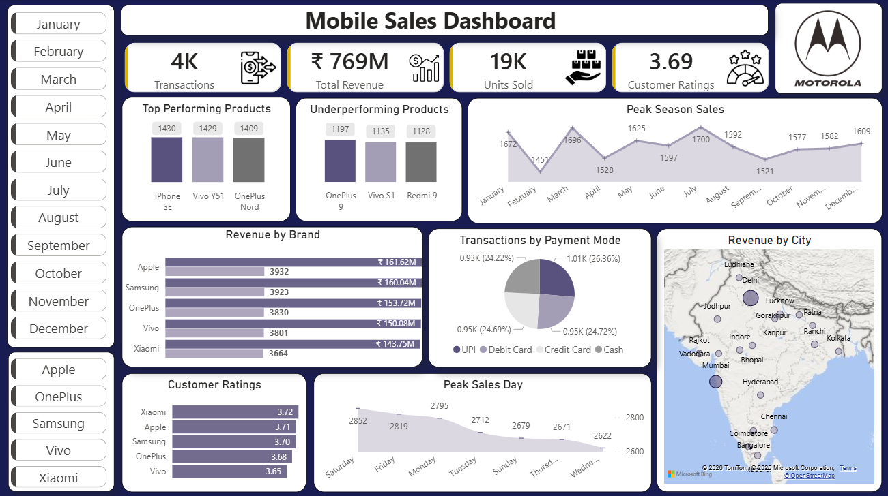

# Mobile Sales Analysis Dashboard (PowerBI & Excel)

## 🧾 Project Overview
This project analyses mobile sales data to uncover insights into product performance, customer behaviour, payment preferences, and regional trends. The objective is to support data-driven decision-making and improve sales strategy, customer satisfaction, and business performance.

## 🎯 Business Problem
The company lacks comprehensive insights into product performance, customer purchasing behaviour, and regional sales trends, making it difficult to optimize inventory, improve customer satisfaction, and maximize revenue.

## 🎯 Objectives
-	Identify top-performing and underperforming products
-	Analyse customer purchasing patterns across time
-	Understand preferred payment methods
-	Evaluate brand performance and customer satisfaction
-	Identify regional sales trends and high-revenue locations

## 📂 Dataset
-	Dataset: Mobile Sales Data
-	Format: Excel (.xlsx)
-	Includes: Transactions ID, Day, Month, Year, Brand, Model, Units Sold, Price Per Unit, Cust Name, Cust Ratings, Payment Modes, City, etc.
-	Size: 3836 rows x 14 columns

## 🧹 Data Cleaning (Excel)
-	Removed duplicate records to ensure data accuracy
-	Standardized Day Name column for consistency
-	Created proper Date column using Day, Month, Year
-	Removed Unnecessary Columns to improve performance
-	Validated data types and ensured consistency across fields

## 📊 Dashboard Features (Power BI)
-	KPI Cards (Total Revenue, Transactions, Units Sold, Customer Ratings)
-	Monthly sales trend analysis
-	Top and underperforming products
-	Revenue by brand
-	Payment mode distribution
-	Sales distribution by city (map visualization)
-	Customer purchasing behaviour by weekday
-	Interactive filters (Month, Brand)

## 💡 Key Insights
-	iPhone SE, Vivo Y51, and OnePlus Nord are the top-performing products contributing significantly to overall sales, while OnePlus 9, Vivo V51, and Redmi 9 underperform, indicating potential pricing or demand issues.
-	Sales peak during weekends and early weekdays, indicating higher customer activity during these periods. 
-	UPI dominates as the preferred payment method, highlighting a shift toward digital transactions. 
-	Delhi and Mumbai generate the highest revenue, showing strong demand in metro cities. 
-	Apple and Samsung lead in both revenue and customer satisfaction, indicating strong brand loyalty and premium positioning.

## 🧠 Business Recommendations
-	Focus marketing efforts on top-performing products to maximize revenue
-	Re-evaluate pricing or promotion strategies for underperforming products
-	Increase promotional campaigns during weekends and high-sales periods
-	Expand operations and marketing in high-performing cities like Delhi and Mumbai
-	Enhance digital payment experience, especially UPI transactions
-	Improve product quality and customer experience for low-rated brands

## 🛠 Tools Used
-	Microsoft Excel (Data Cleaning & Preprocessing)
-	Power BI (Data Visualization & Dashboarding)

## 📸 Dashboard Preview
 

